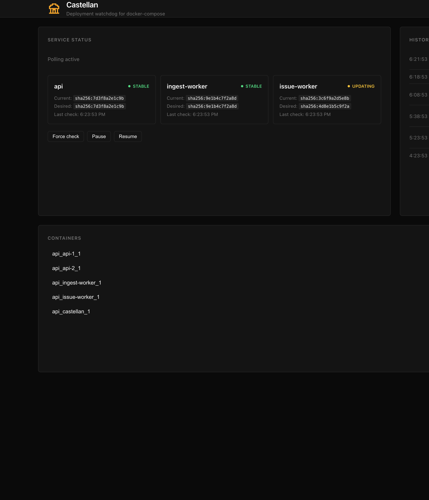

<h1 align="center">
  <picture>
    <source media="(prefers-color-scheme: dark)" srcset="assets/castellan-logo-dark.png" />
    
  </picture>
  Castellan
</h1>

<p align="center">
  <a href="https://github.com/logfoxai/castellan/actions/workflows/ci.yml"></a>
  <a href="https://github.com/logfoxai/castellan/actions/workflows/release.yml"></a>
  <a href="https://www.npmjs.com/package/castellan"></a>
  <a href="https://opensource.org/licenses/MIT"></a>
  
  <a href="https://github.com/mhweiner/autorel"></a>
</p>

<p align="center"><strong>Deployment control &amp; monitoring for docker-compose.</strong></p>

<p align="center">
  Polls your registry, rolls out updates safely, verifies health, rolls back on failure — with a built-in dashboard.
</p>

<p align="center">
  
</p>

> **Beta.** Castellan is actively developed and dogfooded by [Logfox](https://logfox.ai), but it has not seen wide production use outside our own stacks yet. Test in staging before trusting it with critical workloads. APIs and config may change before v1.0.

# What is Castellan?

Castellan is a **single-container sidecar** that sits beside your docker-compose stack. It:

1. **Polls** your container registry (ECR-first) for new image digests on a tunable schedule.
2. **Deploys** updates via `docker compose` — rolling through grouped services (`api-1`, then `api-2`) so one replica stays up.
3. **Verifies** health with HTTP checks and Docker health status before continuing.
4. **Rolls back** automatically if a new digest fails — reverting to the last known-good image like an ECS circuit breaker.
5. **Observes** everything from a self-hosted dashboard: digests, history, container metrics, logs.

One image. No database. No separate controller. Dashboard included.

# Castellan vs Watchtower

[Watchtower](https://containrrr.dev/watchtower/) was archived in December 2025. It was a **simple auto-updater**: poll the registry, pull new images, restart containers. That worked, but it had no health verification, no rollback, no zero-downtime strategy, and no UI.

Castellan is **not a clone of Watchtower**. It is a **safety-first deployment controller** for docker-compose:

| | Watchtower | Castellan |
|---|---|---|
| **Job** | Restart containers when a tag moves | Deploy new digests safely across compose services |
| **Update strategy** | Stop and recreate (downtime) | Rolling restart across grouped compose services |
| **Health checks** | None before/after update | HTTP + Docker health verification |
| **Rollback** | None | Automatic revert to last known-good digest |
| **Change detection** | Tag comparison | Digest comparison (no false pulls) |
| **Dashboard** | None | Built-in, responsive, always included |
| **Config** | Env vars + labels | JSON/YAML config + optional Watchtower labels |
| **Footprint** | One container | One container |

**Migrating from Watchtower?** Castellan can discover containers via the same `com.centurylinklabs.watchtower.enable=true` labels — swap the sidecar, keep your labels. For rolling restarts and rollback you will want a config file; see [Migrating from Watchtower](#migrating-from-watchtower).

**Starting fresh?** Skip the Watchtower labels entirely and use JSON/YAML config — that is the recommended path for new deployments.

# Why Castellan?

- **Compose-native rollouts** — restarts grouped services one at a time via `docker compose pull/up`, not blind container recreation.
- **Automatic rollback** — failed health checks trigger revert to the last known-good digest; bad digests are remembered.
- **Built-in observability** — dashboard with service status, deployment history, container CPU/memory/disk, and logs.
- **ECR-first** — digest polling with tunable intervals, jitter, and rate-limit protection.
- **Small footprint** — one TypeScript sidecar, MIT licensed, no PostgreSQL or multi-service stack.
- **Watchtower label compat** — optional; reads `com.centurylinklabs.watchtower.enable=true` for drop-in migration.

## How alternatives compare

Most tools marketed as "Watchtower replacements" solve a different problem or require a heavier stack. This table is honest about trade-offs — not every checkmark means "better for everyone."

| Tool | Migration | Auto-update | Rollback | Zero-downtime | Dashboard | Notes |
|---|---|---|---|---|---|---|
| **Castellan** | Labels or config | ✅ | ✅ known-good | ✅ compose rolling | ✅ built-in | Single sidecar, MIT, compose-first |
| [Watchtower](https://github.com/containrrr/watchtower) (archived) | — | ✅ | ❌ | ❌ | ❌ | Simple restarter; no safety net |
| [nickfedor/watchtower](https://github.com/nicholas-fedor/watchtower) | ✅ swap image | ✅ | ❌ | ❌ | ❌ | Community fork of archived Watchtower |
| [Lighthouse](https://github.com/grioghar/lighthouse) | ✅ `WATCHTOWER_*` + labels | ✅ | ❌ | ❌ | ❌ | Lightweight Watchtower fork |
| [WatchWarden](https://github.com/watchwarden-labs/watchwarden) | ✅ `WATCHTOWER_*` env vars | ✅ | ✅ any version | ⚠️ per-container blue-green | ✅ managed mode | Feature-rich; BSL license; dashboard needs controller + Postgres |
| [DockWarden](https://github.com/emon5122/dockwarden) | ⚠️ env remap | ✅ | ❌ | ❌ | optional | Watchtower-like with optional UI |
| [WUD](https://github.com/getwud/wud) | ❌ `wud.*` labels | optional | ❌ | ❌ | ✅ | Monitor-first; auto-update optional |
| [Diun](https://github.com/crazy-max/diun) | ❌ notify-only | ❌ | ❌ | ❌ | ❌ | Notifications only, no updates |
| [freshdock](https://github.com/Turbootzz/freshdock) | ❌ `freshdock.*` labels | ✅ | ✅ | ❌ | ❌ | Per-container updates |

**Reading the table:**
- **Migration** — what you can keep from Watchtower. Castellan supports centurylinklabs labels; WatchWarden supports `WATCHTOWER_*` env vars in solo mode.
- **Zero-downtime** varies: Castellan does compose-service rolling; WatchWarden does per-container blue-green (falls back to stop-first when ports conflict).
- **Dashboard** — Castellan's ships in the same container. WatchWarden's dashboard requires the managed stack (controller + PostgreSQL + UI); solo agent mode has no UI.

## Castellan vs WatchWarden (the serious alternative)

[WatchWarden](https://github.com/watchwarden-labs/watchwarden) is the most feature-complete Watchtower successor — multi-host management, Trivy scanning, cosign verification, notifications, update groups, and a rich WebSocket dashboard. Worth evaluating if you need a fleet controller.

Castellan targets a different sweet spot:

| | Castellan | WatchWarden |
|---|---|---|
| **License** | MIT | BSL 1.1 |
| **Deploy** | 1 sidecar | Agent; dashboard needs controller + Postgres + UI |
| **Update model** | Compose rolling (`api-1` → `api-2`) | Per-container blue-green |
| **Best for** | Single compose host, ECR, safety-first rollouts | Multi-host fleet, rich policies, notifications |
| **Maturity** | Beta (early) | Beta (more features, 462+ tests) |

We built Castellan because we wanted a **small, MIT-licensed, compose-native controller** we fully own — not a multi-service platform. If you need fleet management and don't mind BSL + Postgres, WatchWarden may be the better fit.

## What you get beyond Watchtower

| | Watchtower | Castellan |
|---|---|---|
| Compose rolling restarts | ❌ | ✅ |
| Automatic rollback on failure | ❌ | ✅ |
| Health-check verification | ❌ | ✅ |
| Self-hosted dashboard | ❌ | ✅ |
| Container metrics & logs | ❌ | ✅ |
| HTTP API | ❌ | ✅ |
| Digest-based change detection | ❌ | ✅ |
| ECR rate-limit protection | ❌ | ✅ |
| Mobile-responsive dashboard | ❌ | ✅ |


# Features

## Deployment safety

- **Registry polling** with tunable intervals, jitter, and ECR rate-limit protection.
- **Digest-based change detection** — only restarts when the image digest actually changes, eliminating false pulls.
- **Zero-downtime rolling restarts** for grouped compose services (`api-1`, `api-2`, etc.).
- **Automatic rollback** on health-check failure with a persisted known-good digest and a bad-digest list.
- **Manual controls** — check now, pause/resume polling, or trigger a rollback from the UI or API.

## Observability hub

- **Self-hosted React dashboard** — live status, controls, and Docker inspection in one dark, fast UI.
- **Service status cards** — current vs desired image digests, last check time, and last error.
- **Container metrics table** — every container with live CPU, memory (usage + %), disk (writable layer size), state, and one-click log viewing.
- **Deployment history timeline** — check, deploy, rollback, and failure events with timestamps.
- **Health status** — green/yellow/red state badges and detailed HTTP/Docker health verification.
- **Mobile responsive** — check deployments, logs, and container status from your phone without pinching or zooming.

## Integration & compatibility

- **Internal HTTP API** — typed RPC for dashboard, CLI, or automation.
- **Watchtower compatibility mode** — optional label-based discovery for migration; config file recommended for full features.
- **Registry-agnostic** — ECR first, with Docker Hub and GHCR support ready.
- **Bearer token auth** — secure the API in shared environments.
- **YAML and JSON config** — use whichever format you prefer.
- **Small, fast sidecar** — TypeScript, MIT licensed, published to npm and GHCR.

# Quick start

Add Castellan as a sidecar in your `docker-compose.yml`:

```yaml
services:
  castellan:
    image: ghcr.io/logfoxai/castellan:latest
    restart: unless-stopped
    volumes:
      - /var/run/docker.sock:/var/run/docker.sock
      - ./castellan-config.json:/app/config.json:ro
      - ./castellan-state:/app/state
    environment:
      - AWS_REGION=us-east-2
    networks:
      - backend

  # your app services here
```

Create `castellan-config.json` (or `castellan-config.yaml`):

```json
{
  "managedServices": [
    {
      "name": "api",
      "registry": "123456789.dkr.ecr.us-east-2.amazonaws.com",
      "repository": "api-service",
      "tag": "latest",
      "composeServices": ["api-1", "api-2"],
      "healthUrl": "http://{{service}}:3000/health",
      "healthIntervalMs": 5000,
      "healthRetries": 10
    }
  ],
  "poll": {
    "intervalMs": 60000,
    "jitterMs": 5000
  }
}
```

Open the dashboard at `http://castellan:3003/` (or map a port to your host).

# Migrating from Watchtower

Castellan can read the same `com.centurylinklabs.watchtower.enable=true` labels Watchtower used. Swap the sidecar and Castellan discovers labeled containers automatically.

For **rolling restarts, health verification, and rollback** — the features that make Castellan more than Watchtower — add a config file. Label-only mode works for basic auto-updates but skips the safety layer.

Remove your Watchtower service and add Castellan. No config file needed for basic label-based updates:

```yaml
services:
  castellan:
    image: ghcr.io/logfoxai/castellan:latest
    restart: unless-stopped
    volumes:
      - /var/run/docker.sock:/var/run/docker.sock
      - ./castellan-state:/app/state
    networks:
      - backend

  my-service:
    image: my-image:latest
    labels:
      - com.centurylinklabs.watchtower.enable=true
```

Castellan discovers every container carrying the Watchtower label and manages it — same starting point as Watchtower, plus optional health verification and rollback when configured.

For grouped services (e.g. multiple API replicas that need zero-downtime rolling restarts), add a config file — see [Configuration reference](#configuration-reference).

# Configuration reference

```json
{
  "managedServices": [
    {
      "name": "<service-name>",
      "registry": "<registry host>",
      "repository": "<repo name>",
      "tag": "<rolling tag>",
      "composeServices": ["<compose service 1>", "<compose service 2>"],
      "healthUrl": "http://{{service}}:3000/health",
      "healthIntervalMs": 5000,
      "healthRetries": 10
    }
  ],
  "compose": {
    "file": "/app/docker-compose.yml",
    "project": "myapp",
    "envFile": "/app/.env"
  },
  "poll": {
    "intervalMs": 60000,
    "jitterMs": 5000
  },
  "rollback": {
    "healthTimeoutMs": 120000,
    "maxAttempts": 1
  },
  "api": {
    "port": 3003,
    "authToken": "optional-bearer-token"
  }
}
```

- `healthUrl` may use `{{service}}` as a placeholder for the current compose service name.
- `composeServices` is a list; when more than one is present, Castellan restarts them one at a time, waiting for health before proceeding.
- YAML configs are supported — just use `config.yaml` or `config.yml` instead of `config.json`.

# API

Castellan exposes an internal HTTP API on port `3003`:

- `GET /v1/health` — liveness.
- `POST /v1` — typed RPC:
  - `status()` — service states and known-good digests.
  - `forceCheck()` — check registries immediately.
  - `pause()` / `resume()` — pause/resume polling.
  - `rollback({ service })` — manually rollback a service.
  - `history()` — recent events.
  - `dockerContainers()`, `dockerImages()`, `dockerNetworks()`, `dockerVolumes()` — Docker inspection.
  - `dockerLogs({ containerId, tail })`, `dockerStats({ containerId })`, `dockerInfo()`, `dockerEvents({ since })` — logs and stats.

Set `api.authToken` in your config to require authentication. External clients (CLI, automation) send `Authorization: Bearer <token>`. The built-in dashboard authenticates automatically via a same-site session cookie the server sets when it serves the page — no token is ever entered in the browser.

# Dashboard

The dashboard is built into the image and served at `/`. It gives you:

- Live service status with current vs desired image digests.
- **Check now** and **Pause/Resume polling** controls.
- Docker container table with live CPU, memory, disk usage, state, and one-click log viewing.
- Deployment / rollback / failure history timeline.
- Zero-config auth — authenticates via a same-site session cookie, no token to paste.
- Fully responsive — works on phones, tablets, and desktops.
- Light and dark mode with system preference detection.

# How it works

1. Castellan loads your config (or discovers Watchtower-labeled containers).
2. On every poll interval it fetches the manifest for each configured image, respecting per-image TTL and global jitter.
3. When a digest changes, it pulls the image, tags it, and performs a rolling restart of the associated compose services.
4. It waits for Docker and/or HTTP health checks to pass.
5. If health checks fail, it rolls back to the last known-good digest and marks the failing digest as bad.
6. State is persisted atomically to a JSON file so restarts are safe.

# Roadmap

Castellan is beta — these are planned next, informed by what heavier alternatives like WatchWarden already ship:

- **Notifications** — Slack/webhook on deploy, rollback, or failure.
- **Prometheus metrics** — poll latency, deploy outcomes, health results.
- **CLI companion** — `castellan status`, `castellan check`, `castellan rollback <service>`.
- **Minimum update age** — hold a new digest for N minutes before deploying.
- **Crash-loop detection** — rollback when a container restart-loops after update.
- **Image diff preview** — show env/port changes before restart.
- **Multi-host support** — manage several compose hosts from one place (maybe; today Castellan is single-host by design).

Have an idea? Open an issue or discussion.

# Security

Castellan controls the Docker socket and can restart any container it manages. **Treat it as highly privileged infrastructure** — never expose it on the public internet.

## Keep it internal (recommended)

The safest deployment is **VPN-only access** with no public DNS or port mapping:

1. **Do not publish port 3003** to your public NIC. Bind Castellan to `127.0.0.1:3003` inside the host.
2. **Reverse-proxy through an internal edge** (Caddy, nginx, Traefik) that listens only on your VPN interface — e.g. Tailscale IP or `127.0.0.1`.
3. **Use private DNS** so the dashboard is reachable only when connected to your VPN:
  - Prod: `http://castellan.int.logfox.ai:8443/`
  - Local: `http://castellan.local.logfox.test:8443/`
  - Other envs: `http://castellan.<env>.logfox.ai:8443/`

Example Caddy internal edge (binds to Tailscale IP, not the public NIC):

```caddyfile
{
    auto_https off
}

http://castellan.int.logfox.ai:8443 {
    bind {$TAILSCALE_IP}
    reverse_proxy 127.0.0.1:3003
}
```

Split DNS (Tailscale, CoreDNS, etc.) resolves `*.int.logfox.ai` to your compose host's Tailscale IP. Without VPN membership, the hostname does not resolve and the port is not reachable.

## Require a Bearer token (defense in depth)

Even on a private network, set `api.authToken` so every API request requires authentication:

```json
{
  "api": {
    "port": 3003,
    "authToken": "generate-a-long-random-secret"
  }
}
```

**External clients** (CLI, curl, automation) send `Authorization: Bearer <token>`.

**The dashboard authenticates itself.** When Castellan serves the dashboard, it sets an `httpOnly`, `SameSite=Strict` session cookie so the browser's API calls are authorized automatically — the token stays purely a server-side config value and is never entered or stored in the browser. The cookie is not readable by JavaScript, and because it is same-site it cannot be used in cross-site requests. Access to the dashboard is therefore gated by network reachability (keep it VPN-only, per above).

In production, store the token in a secrets manager and inject it at deploy time (Logfox uses AWS Secrets Manager via `host-config.json`).

## Other hardening

- Mount the Docker socket read-only if your runtime supports it; Castellan only needs the API surface it uses.
- Run Castellan on an isolated Docker network; do not expose it alongside public-facing services without the internal edge pattern above.
- Rotate `authToken` if it is ever leaked — Castellan reads config at startup.

# Built by the team behind [Logfox](https://logfox.ai)

We build observability and deployment tools we actually want to use. If you like Castellan, star the repo and tell your friends.

# More open-source tools from Logfox

Castellan is part of a family of MIT-licensed tools we ship and dogfood. Same vibe: sharp CLIs, great TUIs, built for real ops work.


| Tool                                                         | What it does                                                                                                                 |
| ------------------------------------------------------------ | ---------------------------------------------------------------------------------------------------------------------------- |
| **[open-prs](https://github.com/logfoxai/open-prs)**         | Live TUI + CLI dashboard for every open PR in a GitHub org — CI status, deploy tracking, clickable links.                    |
| **[ecswatch](https://github.com/logfoxai/ecswatch)**         | ECS service watcher with CI streaming, interactive TUI, and one-shot `inspect` snapshots. Optional LLM root-cause analysis.  |
| **[composewatch](https://github.com/logfoxai/composewatch)** | Sibling of ecswatch for Docker Compose stacks over Tailscale SSH — watch Watchtower/Castellan rollouts, health, and digests. |
| **[runtyp](https://github.com/logfoxai/runtyp)**             | Lightning-fast, zero-dependency runtime type validation for TypeScript and JavaScript.                                       |


All published to npm, released with [AutoRel](https://github.com/mhweiner/autorel), and designed to be useful outside Logfox too.

# License

MIT — see [LICENSE](LICENSE).