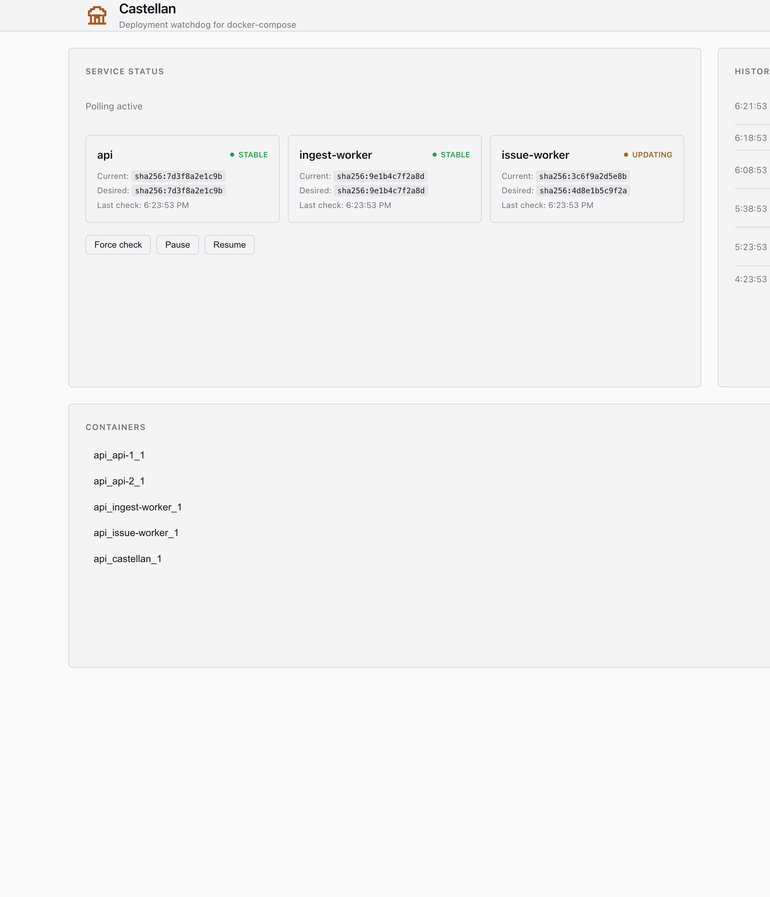

# Castellan

<p align="center">
  
</p>

<p align="center">
  <a href="https://github.com/logfoxai/castellan/actions/workflows/ci.yml"></a>
  <a href="https://github.com/logfoxai/castellan/actions/workflows/release.yml"></a>
  <a href="https://www.npmjs.com/package/castellan"></a>
  <a href="https://opensource.org/licenses/MIT"></a>
  <a href="https://github.com/logfoxai/castellan"></a>
  <a href="https://github.com/mhweiner/autorel"></a>
</p>

<h3 align="center">A drop-in Watchtower replacement with superpowers.</h3>

<p align="center">
  <strong>Open-source, registry-aware deployment watchdog for docker-compose.</strong><br />
  Drop it in as a sidecar, keep your existing labels, and instantly get zero-downtime rollouts, automatic rollback, health monitoring, and a beautiful Docker observability dashboard.
</p>

<p align="center">
  
</p>

<p align="center">
  
</p>

## Why Castellan?

[Watchtower](https://containrrr.dev/watchtower/) is deprecated. Castellan is the modern, drop-in replacement:

- **Same labels, zero config** — if you already use `com.centurylinklabs.watchtower.enable=true`, Castellan will manage those containers immediately.
- **Safer updates** — rolling restarts and health verification, not blind restarts.
- **Automatic rollback** — if a new image fails health checks, Castellan reverts to the last known-good digest like an ECS circuit breaker.
- **Built-in observability** — live dashboard, deployment history, container logs, and health status in one place.
- **Extensible** — HTTP API, Bearer auth, YAML/JSON config, and ECR-first registry support.

### What you get beyond Watchtower

| | Watchtower | Castellan |
|---|---|---|
| Drop-in label compatibility | ✅ | ✅ |
| Zero-downtime rolling restart | ❌ | ✅ |
| Automatic rollback on failure | ❌ | ✅ |
| Health-check verification | ❌ | ✅ |
| Self-hosted dashboard | ❌ | ✅ |
| Container logs & inspection | ❌ | ✅ |
| HTTP API + CLI integration | ❌ | ✅ |
| Digest-based change detection | ❌ | ✅ |
| ECR rate-limit protection | ❌ | ✅ |

## Features

### Deployment safety

- **Registry polling** with tunable intervals, jitter, and ECR rate-limit protection.
- **Digest-based change detection** — only restarts when the image digest actually changes, eliminating false pulls.
- **Zero-downtime rolling restarts** for grouped compose services (`api-1`, `api-2`, etc.).
- **Automatic rollback** on health-check failure with a persisted known-good digest and a bad-digest list.
- **Manual controls** — force a check, pause/resume polling, or trigger a rollback from the UI or API.

### Observability hub

- **Self-hosted React dashboard** — live status, controls, and Docker inspection in one dark, fast UI.
- **Service status cards** — current vs desired image digests, last check time, and last error.
- **Container list** — see every container Castellan can see, with live state and one-click log viewing.
- **Deployment history timeline** — check, deploy, rollback, and failure events with timestamps.
- **Health status** — green/yellow/red state badges and detailed HTTP/Docker health verification.

### Integration & compatibility

- **Internal HTTP API** — typed RPC for dashboard, CLI, or automation.
- **Watchtower compatibility mode** — works with existing Watchtower labels, no config required.
- **Registry-agnostic** — ECR first, with Docker Hub and GHCR support ready.
- **Bearer token auth** — secure the API in shared environments.
- **YAML and JSON config** — use whichever format you prefer.
- **Small, fast sidecar** — TypeScript, MIT licensed, published to npm and GHCR.

## Quick start

Add Castellan as a sidecar in your `docker-compose.yml`:

```yaml
services:
  castellan:
    image: ghcr.io/logfoxai/castellan:latest
    restart: unless-stopped
    volumes:
      - /var/run/docker.sock:/var/run/docker.sock
      - ./castellan-config.json:/app/config.json:ro
      - ./castellan-state:/app/state
    environment:
      - AWS_REGION=us-east-2
    networks:
      - backend

  # your app services here
```

Create `castellan-config.json` (or `castellan-config.yaml`):

```json
{
  "managedServices": [
    {
      "name": "api",
      "registry": "123456789.dkr.ecr.us-east-2.amazonaws.com",
      "repository": "api-service",
      "tag": "latest",
      "composeServices": ["api-1", "api-2"],
      "healthUrl": "http://{{service}}:3000/health",
      "healthIntervalMs": 5000,
      "healthRetries": 10
    }
  ],
  "poll": {
    "intervalMs": 60000,
    "jitterMs": 5000
  }
}
```

Open the dashboard at `http://castellan:3003/` (or map a port to your host).

## Migrating from Watchtower

If you already use Watchtower labels, just add Castellan and remove Watchtower. No config file needed:

```yaml
services:
  castellan:
    image: ghcr.io/logfoxai/castellan:latest
    restart: unless-stopped
    volumes:
      - /var/run/docker.sock:/var/run/docker.sock
      - ./castellan-state:/app/state
    networks:
      - backend

  my-service:
    image: my-image:latest
    labels:
      - com.centurylinklabs.watchtower.enable=true
```

For grouped services (e.g. multiple API replicas), add a config file to enable rolling restarts.

## Configuration reference

```json
{
  "managedServices": [
    {
      "name": "<service-name>",
      "registry": "<registry host>",
      "repository": "<repo name>",
      "tag": "<rolling tag>",
      "composeServices": ["<compose service 1>", "<compose service 2>"],
      "healthUrl": "http://{{service}}:3000/health",
      "healthIntervalMs": 5000,
      "healthRetries": 10
    }
  ],
  "compose": {
    "file": "/app/docker-compose.yml",
    "project": "myapp",
    "envFile": "/app/.env"
  },
  "poll": {
    "intervalMs": 60000,
    "jitterMs": 5000
  },
  "rollback": {
    "healthTimeoutMs": 120000,
    "maxAttempts": 1
  },
  "api": {
    "port": 3003,
    "authToken": "optional-bearer-token"
  }
}
```

- `healthUrl` may use `{{service}}` as a placeholder for the current compose service name.
- `composeServices` is a list; when more than one is present, Castellan restarts them one at a time, waiting for health before proceeding.
- YAML configs are supported — just use `config.yaml` or `config.yml` instead of `config.json`.

## API

Castellan exposes an internal HTTP API on port `3003`:

- `GET /v1/health` — liveness.
- `POST /v1` — typed RPC:
  - `status()` — service states and known-good digests.
  - `forceCheck()` — check registries immediately.
  - `pause()` / `resume()` — pause/resume polling.
  - `rollback({ service })` — manually rollback a service.
  - `history()` — recent events.
  - `dockerContainers()`, `dockerImages()`, `dockerNetworks()`, `dockerVolumes()` — Docker inspection.
  - `dockerLogs({ containerId, tail })`, `dockerStats({ containerId })`, `dockerInfo()`, `dockerEvents({ since })` — logs and stats.

Set `api.authToken` in your config to require a `Bearer` token on every request.

## Dashboard

The dashboard is built into the image and served at `/`. It gives you:

- Live service status with current vs desired image digests.
- One-click **Force check**, **Pause**, and **Resume** controls.
- Docker container list with live state and one-click log viewing.
- Deployment / rollback / failure history timeline.
- Optional Bearer token input for authenticated APIs.

## How it works

1. Castellan loads your config (or discovers Watchtower-labeled containers).
2. On every poll interval it fetches the manifest for each configured image, respecting per-image TTL and global jitter.
3. When a digest changes, it pulls the image, tags it, and performs a rolling restart of the associated compose services.
4. It waits for Docker and/or HTTP health checks to pass.
5. If health checks fail, it rolls back to the last known-good digest and marks the failing digest as bad.
6. State is persisted atomically to a JSON file so restarts are safe.

## Roadmap / ideas

Castellan is already useful, but the sky is the limit. Ideas we are excited about:

- **Container stats panel** — live CPU, memory, and network graphs for selected containers.
- **Images, networks, and volumes views** — browse all Docker resources from the dashboard.
- **Prometheus metrics export** — expose deployment counts, health results, and poll latency.
- **Webhook / Slack / Discord notifications** — ping your team on deploy, rollback, or failure.
- **CLI companion** — `castellan status`, `castellan force-check`, `castellan rollback <service>`.
- **OpenAPI / REST spec** — a formal public API for integrations.
- **Multi-host and Swarm support** — watch deployments across a fleet of nodes.
- **Dry-run mode** — preview what would change without touching containers.
- **Maintenance windows** — pause polling automatically during scheduled deploys.
- **Image promotion & retention policies** — prune old images and keep only the last N known-good digests.
- **Audit log** — immutable, exportable record of every deployment decision.
- **Dark / light mode** and mobile-friendly dashboard.
- **Alerting on health drift** — notify when a service has been unhealthy for too long.

Have an idea? Open an issue or discussion.

## Security

- Run the API behind your internal network or reverse proxy.
- Set `api.authToken` to require a Bearer token.
- Mount the Docker socket read-only if your runtime supports it; Castellan only needs the API surface it uses.

## Built by the team behind [Logfox](https://logfox.ai)

We build observability and deployment tools we actually want to use. If you like Castellan, star the repo and tell your friends.

## License

MIT — see [LICENSE](LICENSE).
